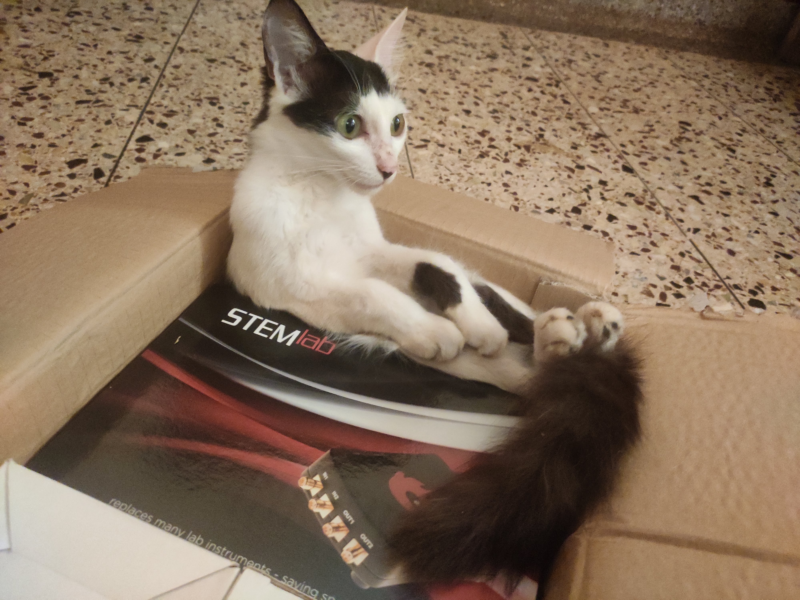
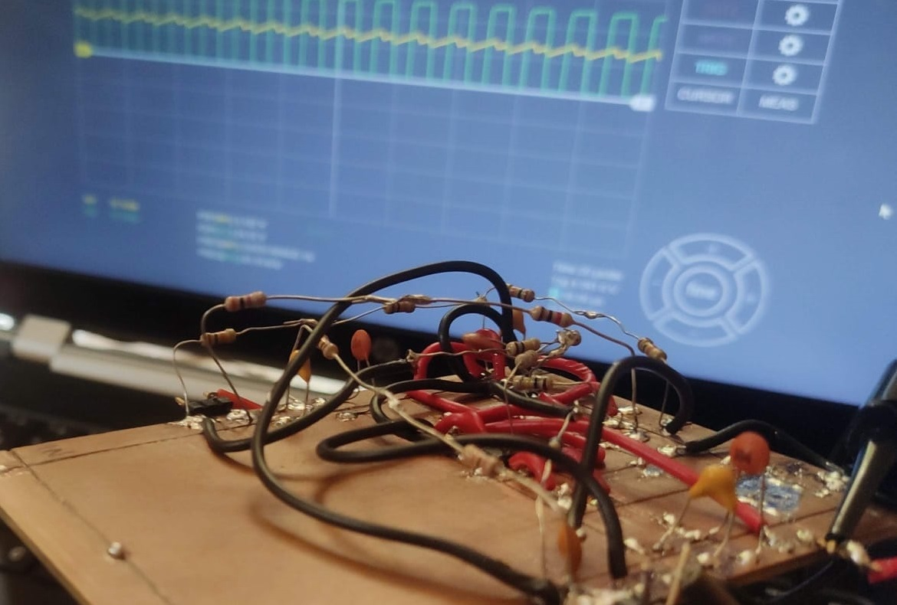
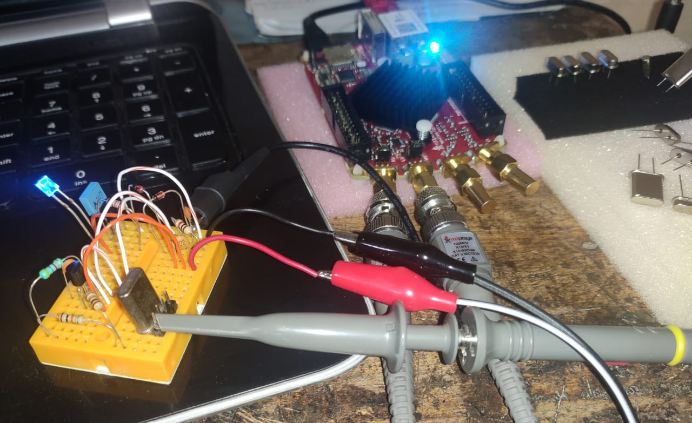
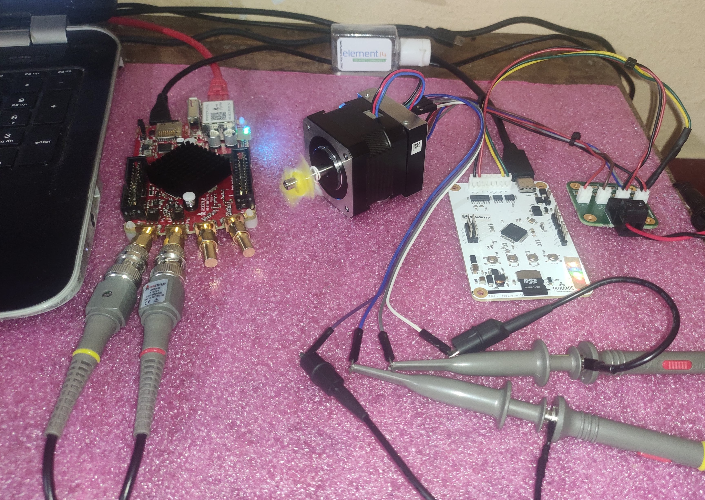

# redpitaya_student_tryout

#### Repo for project submission of the [RedPitaya student tryout program](https://go.redpitaya.com/get-a-free-red-pitaya-for-a-student-project?utm_content=169098616&utm_medium=social&utm_source=linkedin&hss_channel=lcp-3236576) + my frenzy experiences working on several other projets with the [STEMLab125-10](https://redpitaya.com/stemlab-125-10/)!
 
   
 
#### Unboxing RedPitaya STEMLab125-10: https://www.youtube.com/watch?v=aEXXjhqPiG8  
 
 
 
  
#### Projects  
- [x] High Frequency Voltage Controlled Oscillator  
- [x] Transistor Noise Generator  
- [x] Crystal Oscillator Tester  
- [ ] Negative Voltage Generator with IC555  

#### Curious?

	
How did I get to know about RedPitaya?

    
From RedPitaya LinkedIn page. The STEMLab kit looked intersting and upon browsing videos, blogs were all over in Element14 Community, Hackster, EEVblog, University Websites etc.

  

	
What was my first impression on the kit?

    
All-rounder, cute, small, powerful, affordable, full stack-device for doing anything and everything with electronics

  

	
How did I get started with the kit?

    
The kit is so well designed that its almost a plug-and-play! [RedPitaya documentation](https://redpitaya.readthedocs.io/en/latest/) helps keep baby steps and with a how-to guide for all the features in the kit. I also found [RedPitaya forum](https://forum.redpitaya.com/) to be super useful.

  

	
Would you recommed RedPitaya to your friends, colleauges?

    
Absolutely, yes. Some of my friends are already taking advantage of the power of STEMLab kit!

  