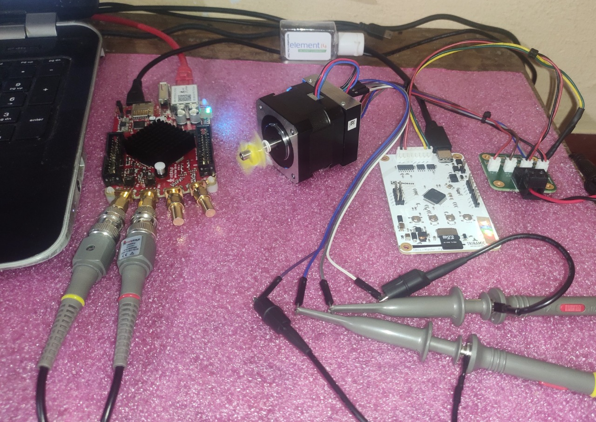
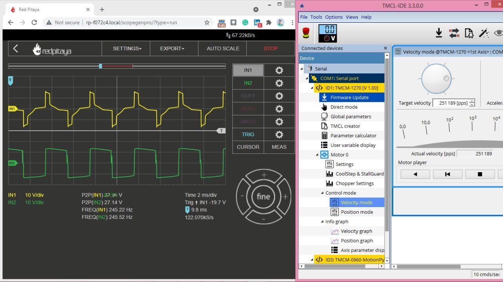

# RedPitaya Student Project

#### Repo of project submission for the [RedPitaya student tryout program](https://go.redpitaya.com/get-a-free-red-pitaya-for-a-student-project?utm_content=169098616&utm_medium=social&utm_source=linkedin&hss_channel=lcp-3236576) + my frenzy experiences working on several other projects with the [STEMLab125-10](https://redpitaya.com/stemlab-125-10/)!
 
### Projects:  
- [x] [Stepper Motor Controller using PYNQ-Z2](https://github.com/NavadeepGaneshU/redpitaya_student_tryout/tree/main/pynq_stepper_ctrl)
- [x] [High Frequency Voltage Controlled Oscillator](https://github.com/NavadeepGaneshU/redpitaya_student_tryout/tree/main/highfreq_vco_main)  
- [x] [Transistor Noise Generator](https://github.com/NavadeepGaneshU/redpitaya_student_tryout/tree/main/noise_gen)  
- [x] [Crystal Oscillator Tester](https://github.com/NavadeepGaneshU/redpitaya_student_tryout/tree/main/xtal_tester)  
 
### RedPitaya STEMLab125-10 caught on action in my other projects and testing:  

- [x] [PD42-1270 Stepper Motor | StealthChop Feature | YouTube](https://youtu.be/qxGunMZJBtk?t=96)  
- [x] [MAX77714 PMIC EVM | Voltage and Load Test | YouTube](https://youtu.be/JADv-FF_pBQ?t=208)  

  
 
 
#### Unboxing the RedPitaya STEMLab125-10: https://www.youtube.com/watch?v=aEXXjhqPiG8  
 
 
 

### Curious?

	
How did I get to know about RedPitaya?

    
From RedPitaya LinkedIn page. The STEMLab kit looked intersting and upon browsing videos, blogs were all over in Element14 Community, Hackster, EEVblog, University Websites etc.

  

	
What was my first impression on the kit?

    
All-rounder, cute, small, powerful, affordable, full stack-device for doing anything and everything with electronics.

  

	
How did I get started with the kit?

    
The kit is so well designed that its almost a plug-and-play! RedPitaya documentation helps keep baby steps and with a how-to guide for all the features in the kit. I also found RedPitaya forum to be super useful.

  

	
Would you recommed RedPitaya to your friends, colleauges?

    
Absolutely, yes. Some of my friends are already taking advantage of the power of STEMLab kit!

  