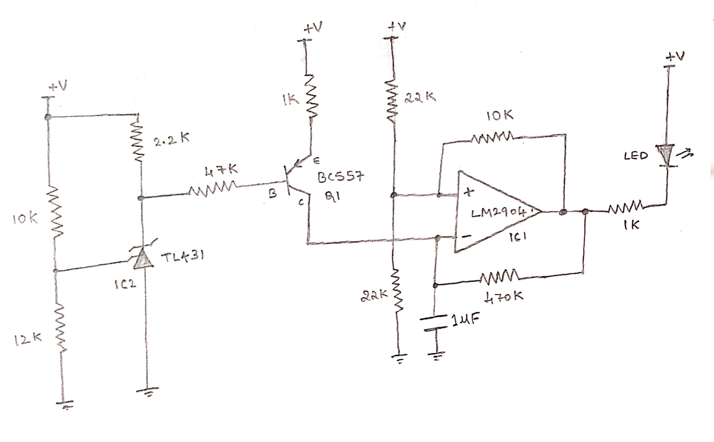
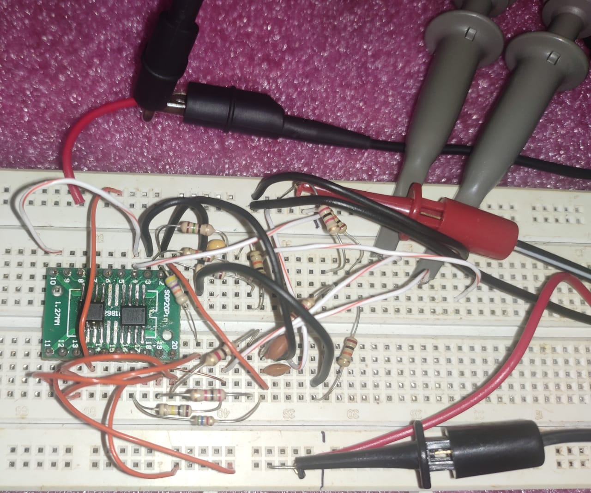
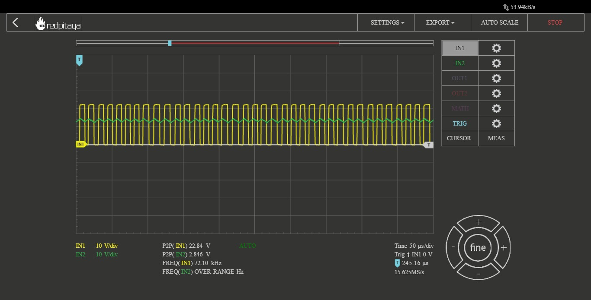
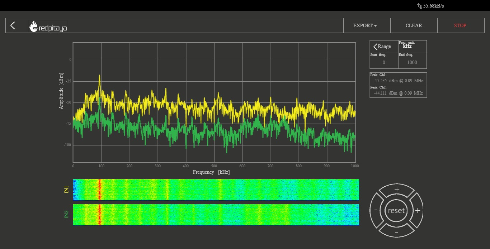
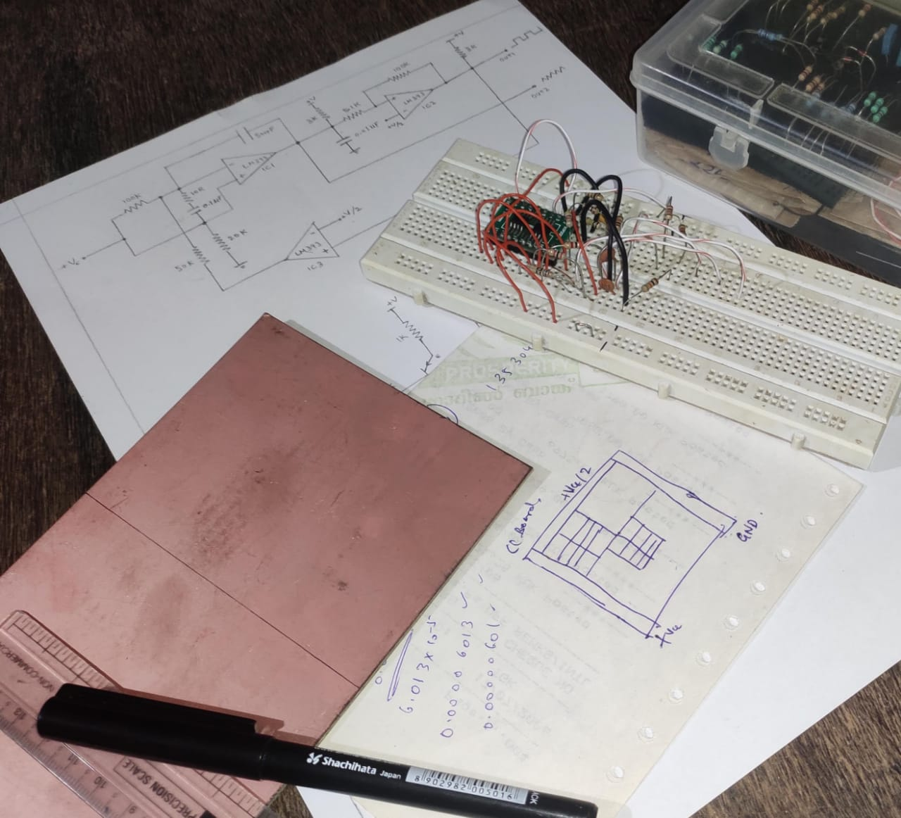
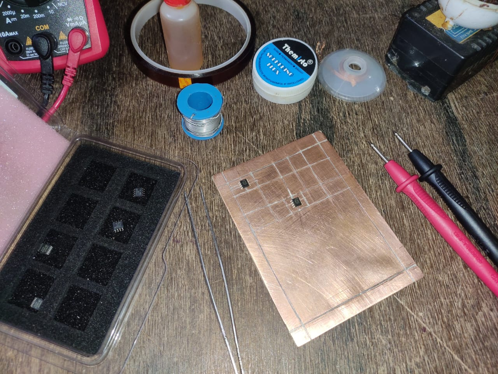
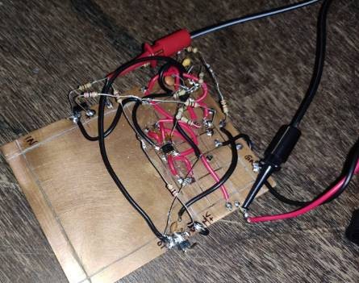
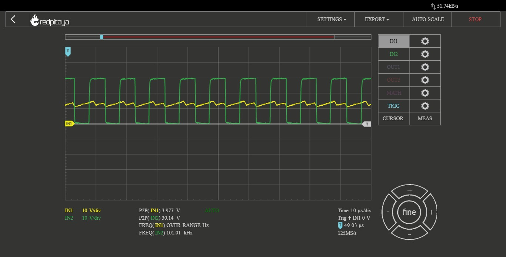
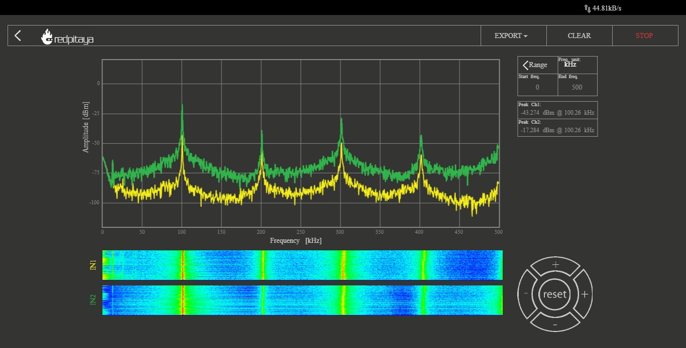

# DIY High Frequency Voltage Controlled Oscillator(VCO)

VCO. Voltage Controlled Oscillators are fairly popular circuits used as subsections in PLLs, Music Synthesizers, Test and Measurements for generating known signals, etc.

Here is an easy and simple high-frequency VCO design that comes from one of the application circuits in the datasheet and uses 3 x LM393 comparators to generate square, triangular signals. I was specifically interested in its 'high frequency' range of 700Hz to 100kHz and the topology with center-tapped voltage, square wave feedback caught interest.

I tried to wire up this on a breadboard and sneak into the signals with an oscilloscope. Using a supply of 24V DC and by adjusting input voltage +Vc between +250mV to +24V DC, signal frequency ranging from 1kHz to 90kHz is observed! 

There is a lot of noise and ripples in here though, and I wonder if that has to do a lot with breadboard's stray R, L, C effects. Isn't breadboarding good for this range of signals? What more good ways to quickly prototype a design? Cladboard?(i wish i could reuse the components.......greedy haha)

There is a lot of noise and ripple in here though(no sharp peak in frequency domain), and I wonder if that has to do a lot with The breadboard's stray R, L, C effects. Isn't breadboarding good for this range of frequencies? What more good ways to quickly prototype a design?  
The application example in LM393 datasheet did show that the it's a two-decade VCO with a 100kHz range and I definitely wanted to try cranking up still further. Having equipped with STEMLab125-10, what should stop the curiosity, right?

I had heard about good old copper cladboard prototyping method which is quite more reliable when it comes to designing high frequency and RF circuits. So, I got a piece of copper clad board, sanded out all the tarnish and planned a layout to fit in the two of SOIC-8 LM393 chips. Because this was a thing which I had never tried, I looked up at some videos on tips and tricks for cardboard prototyping. 
 technical article by Analog Devices on Jim Williams is insightful.  by W2AEW,  by Leo's Bag of Tricks are inspirational to see and learn.

 

Cutting the board and scratching the layout was a bit painful without the machine tool. A nice sharp acrylic/perspex cutter will do the job for manual usage. After breathing some solder smoke and a couple of burnouts on my fingers, here it is!!!

Quickly hooked up the probes to this circuit, pulled my browser and there comes a nice GUI asking what to choose from a suprising list of all expensive tool which I couldn't think of buying each. Choosing Oscilloscope mode of RedPitaya STEMLab125-10, this is what showed up:

That's upto a point of 101kHz! And sneaking into frequency domain, there's this sharp peak at 100.26kHz and harmonics all after it. The signal is less noisy and strong at points of peak highlighted by a uniform bell curve in frequency domain spectrum.

Applications:
* Production of electronic music.  
* Signal generators and references.  
* Testing the circuit characteristics and responses.  

Here is a short video on VCO functionality. I am sweeping the input voltage and thereby output square and triangular signal frequency sweeps, hitting 83kHz output signal frequency.
### Project Demo Video: https://www.youtube.com/watch?v=udZLteKwTNI

References:  
[1] https://www.ti.com/lit/ds/symlink/lm393-n.pdf  
[2] https://www.youtube.com/watch?v=EeYL6lJsNT8  
[3] http://www.till.com/articles/QuadTrapVCO/  
