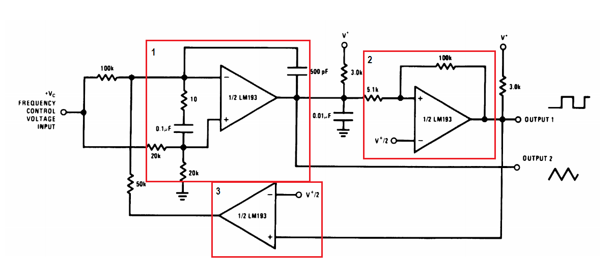
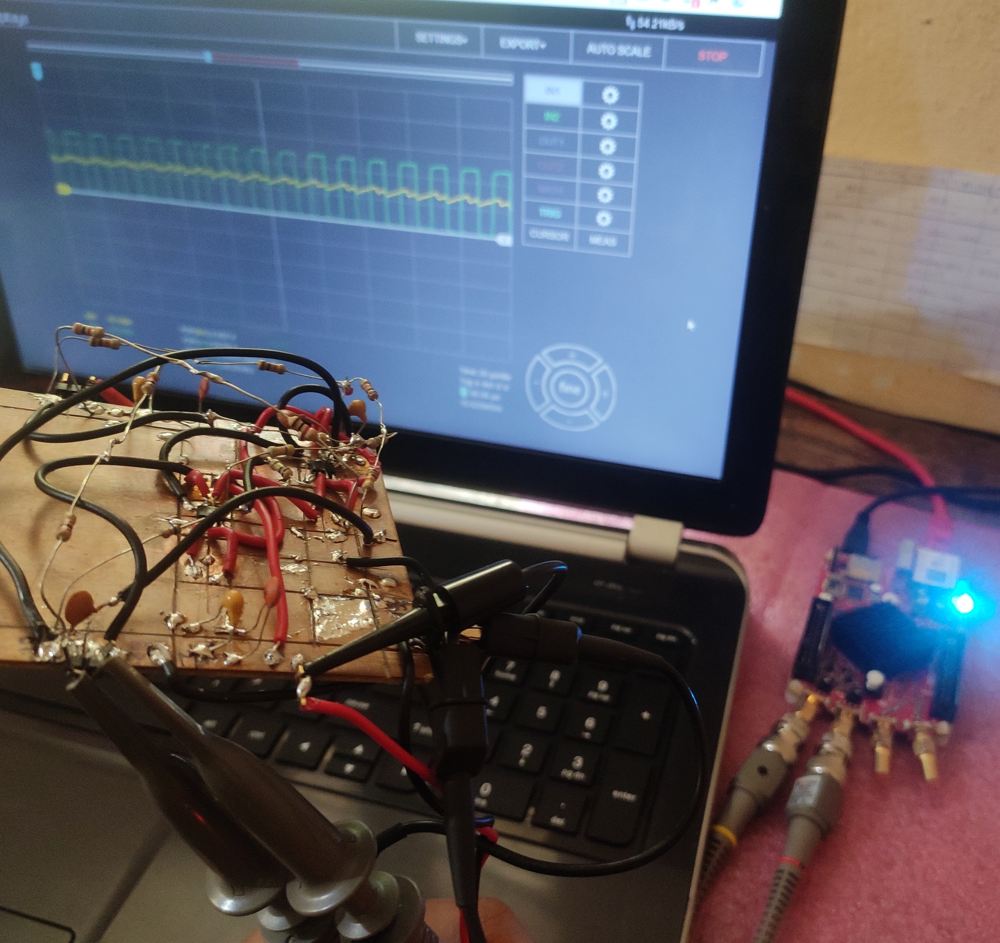

# DIY High Frequency Voltage Controlled Oscillator(VCO)

VCO. Voltage Controlled Oscillators are fairly popular circuits used as subsections in PLLs, Music Synthesizers, Test and Measurements for generating known signals, etc.

Here is an easy and simple high-frequency VCO design using 3 x LM393 comparators and passives which is capable of generating square, triangular wave signals with tunable frequency tange upto 100kHz depending on the control voltage +Vc fed into the circuit. 

I tried wiring up this circuit on a breadboard using all through hole parts exept the 3 x LM393 SMDs on a SOIC-8 to DIP adapter, with a supply of 24V DC and by adjusting input voltage +Vc between +250mV to +24V DC.  
LM393 SOIC-8 package comes as a dual comparator and so each block is 1/2 LM393. Here, Block2 is a square wave generator using the classic LM393 comparator as Schmitt trigger with non-inverting terminal feedback and inverting terminal gets Vc/2.
Over Block1, the voltage divider arrangement is put and because of this, half of the control voltage that is given in always goes to the non-inverting terminal of the OpAmp. The same level of voltage is maintained at the negative terminal too. This is to sustain the voltage across the first 100K as half of the control voltage.  
Block 3 with an open-loop plain comparator takes reference of Vc/2 with respect to the Output1 and feeds it back to Block1 which controls charging/discharging of the capacitor in Block1 OpAmp feedback via a 100K resistor creating a slowly increasing and decreasing voltage at the output(triangular wave). Overall, all the networks have a sense of input control voltage +Vc and get control over the frequency of the output signal.
Quickly wired it up on a breadboard and here goes the test:

Quickly hooked up the probes to this circuit, pulled my browser and there comes a nice GUI asking what to choose from a suprising list of all expensive tool which I couldn't think of buying each. Choosing Oscilloscope mode of RedPitaya STEMLab125-10, this is what showed up:

There is a lot of noise and ripple in here though(no sharp peak in frequency domain), and I wonder if that has to do a lot with The breadboard's stray R, L, C effects. Isn't breadboarding good for this range of frequencies? What more good ways to quickly prototype a design?  
The application example in LM393 datasheet did show that the it's a two-decade VCO with a 100kHz range and I definitely wanted to try cranking up still further. Having equipped with STEMLab125-10, what should stop the curiosity, right?

I had heard about good old copper cladboard prototyping method which is quite more reliable when it comes to designing high frequency and RF circuits. So, I got a piece of copper clad board, sanded out all the tarnish and planned a layout to fit in the two of SOIC-8 LM393 chips. Because this was a thing which I had never tried, I looked up at some videos on tips and tricks for cardboard prototyping. 
[This](https://www.analog.com/media/en/technical-documentation/technical-articles/ubm_edn_20110714%20wms%20trib.pdf) technical article by Analog Devices on Jim Williams is insightful. [Prototyping oscillator on clad board](https://www.youtube.com/watch?v=blalAktxFoI) by W2AEW,  by Leo's Bag of Tricks are inspirational to see and learn.

 

Cutting the board and scratching the layout was a bit painful without the machine tool. A nice sharp acrylic/perspex cutter will do the job for manual usage. After breathing some solder smoke and a couple of burnouts on my fingers, here it is!!!

 

That's upto a point of 101kHz! And sneaking into frequency domain, there's this sharp peak at 100.26kHz and harmonics all after it. The signal is less noisy and strong at points of peak highlighted by a uniform bell curve in frequency domain spectrum.

Applications:
* Production of electronic music.  
* Signal generators and references.  
* Testing the circuit characteristics and responses.  

Here is a short video on VCO functionality. I am sweeping the input voltage and thereby output square and triangular signal frequency sweeps, hitting 83kHz output signal frequency.
### Project Demo Video: https://www.youtube.com/watch?v=udZLteKwTNI

References:  
[1] https://www.ti.com/lit/ds/symlink/lm393-n.pdf  
[2] https://www.youtube.com/watch?v=EeYL6lJsNT8  
[3] http://www.till.com/articles/QuadTrapVCO/  
