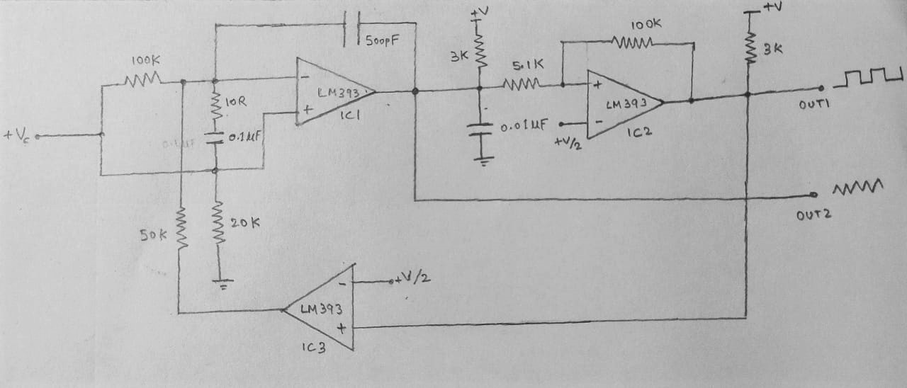

# DIY High Frequency Voltage Controlled Oscillator(VCO)

VCO. Voltage Controlled Oscillators are fairly popular circuits used as subsections in PLLs, Music Synthesizers, Test and Measurements for generating known signals, etc.

Here is an easy and simple high-frequency VCO design that comes from one of the application circuits in the datasheet and uses 3 x LM393 comparators to generate square, triangular signals. I was specifically interested in its 'high frequency' range of 700Hz to 100kHz and the topology with center-tapped voltage, square wave feedback caught interest.

I tried to wire up this on a breadboard and sneak into the signals with an oscilloscope. Using a supply of 24V DC and by adjusting input voltage +Vc between +250mV to +24V DC, signal frequency ranging from 1kHz to 90kHz is observed! 

There is a lot of noise and ripples in here though, and I wonder if that has to do a lot with breadboard's stray R, L, C effects. Isn't breadboarding good for this range of signals? What more good ways to quickly prototype a design? Cladboard?(i wish i could reuse the components.......greedy haha)

 

Applications:
* Production of electronic music.  
* Signal generators and references.  
* Testing the circuit characteristics and responses.  

### Project Demo Video: https://www.youtube.com/watch?v=udZLteKwTNI

References:  
[1] https://www.ti.com/lit/ds/symlink/lm393-n.pdf  
[2] https://www.youtube.com/watch?v=EeYL6lJsNT8  
[3] http://www.till.com/articles/QuadTrapVCO/  
