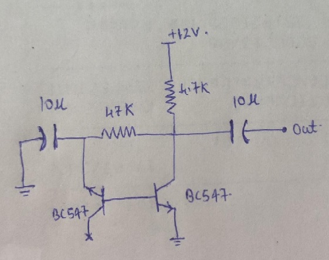

# Noise Generator Circuit

Noise. It's everywhere and is inevitable, but it comes essential sometimes specifically and is fun to play with randomness. I tried to use a 2 transistor noise generator circuit which infact induces noise in one transistor with an open collector and the other one amplifies it to provide the noisy output.
The output is random and peaks are over around 0 to 30kHz(in the spectrum waterfall chart). 

I have built the circuit with the most common BC547 NPN transistor, 4.7K,47K resistors and boom! There is the generated noise. The power supply of 15V is given to the circuit and noise starts coming up after 12V. At the output, it starts at 0V, slowly rises, and when input is 12V, noise starts generating and the voltage level starts deteriorating down and random spread is seen. When turned off, the capacitor takes the output down to full negative and slowly comes up to 0 at full discharge. This was the first circuit which I worked on and tested with the new RedPitaya STEMLab125-10 Kit!

The above frequency domain spectrum shows the random and even distribution of signals over a span of 0kHz to 10kHz. The next one is zoomed out version of it which shows the strong signal distribution under 10kHz and further deteriorates. 

#### Project Demo Video: https://www.youtube.com/watch?v=qRXRiXFY2to
