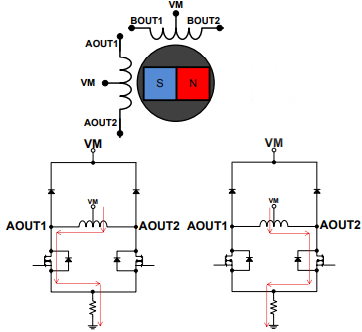
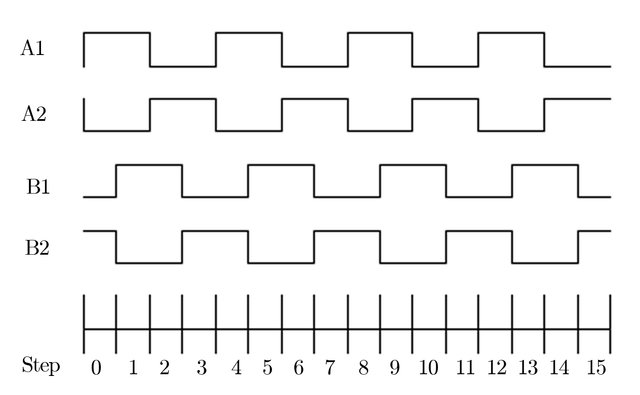
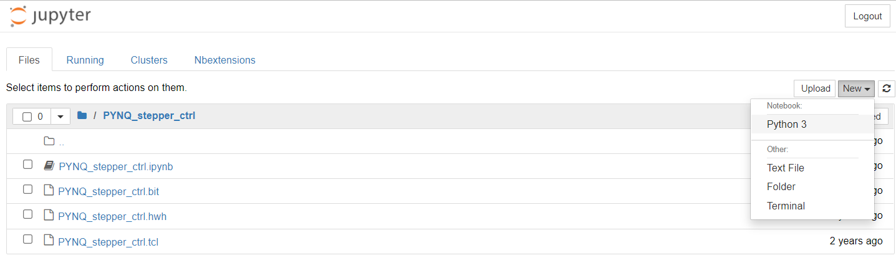
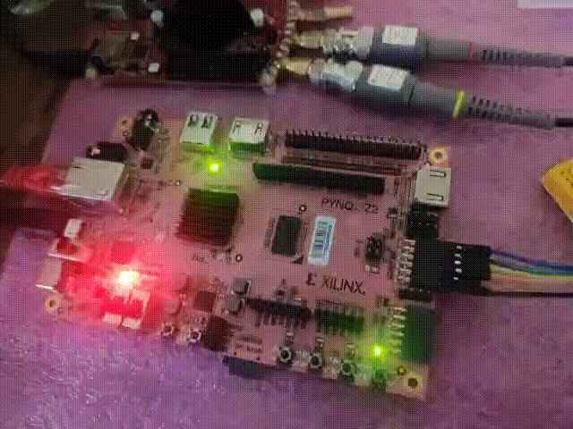
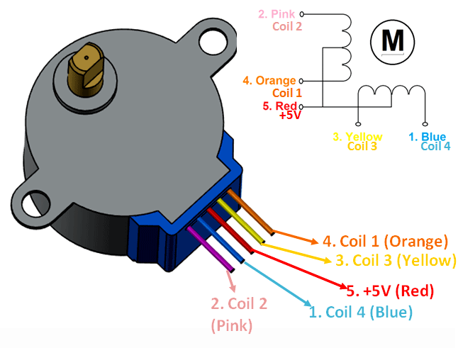

#Stepper Motor Controller using PYNQ-Z2(with tuneable speed)

Stepper Motors are by far the most commonly found part when it comes to motion control and its applications. From a toy piece to robotic arm and 3D Printer they're in. But there's a catch. Its not very straight forward to control or operate these stepper motors withough dedicated drivers as it specifically needs a coil activation sequence to rotate and control speed.  
Here's a project on implementing a soft core stepper controller on FPGA and running a custom overlay on PYNQ to control the motor using Python programming. One of the benefit of this method would be to easily scale up the stepper controller design and implement multiple of them on digital logics.  

 

So now, the main aim is to generate the stepper motor coil sequence to run it and this is digitally implemented using a [Johnson Counter](https://www.electronics-tutorials.ws/sequential/seq_6.html) written in Hardware Description Language(HDL), put into FPGA and mapping outputs to a PMOD to drive motor.   

```verilog
//verilog code to implement a johnson counter with goLeft, goRight, stop being 3 parameters for operation of the counter.

module jc2 (
    goLeft,
    goRight,
    stop,
    clk,
    q	   );

input goLeft;
input goRight;
input stop;
input clk;
output [3:0] q;
reg [3:0] q;

reg run;
reg [0:0] dir;

always @(posedge clk) begin: _jc2_logic
    if ((goRight == 0)) begin
        dir <= 1'b0;
        run <= 1;
    end
    else if ((goLeft == 0)) begin
        dir <= 1'b1;
        run <= 1;
    end
    if ((stop == 0)) begin
        run <= 0;
    end
    if (run) begin
        // synthesis parallel_case full_case
        casez (dir)
            1'b1: begin
                q[4-1:1] <= q[3-1:0];
                q[0] <= (!q[3]);
            end
            default: begin
                q[3-1:0] <= q[4-1:1];
                q[3] <= (!q[0]);
            end
        endcase
    end
end
endmodule
```

This verilog design is implemented on Xilinx ZYNQ7020 SoC, Vivado WebPack tool is used for implementation and the design is accessed using a custom overlay through Jupyter Notebook pytho programming utility. Through the overlay, input variables
```   
    goLeft,
	goRight,
    stop,
    clk, 
```
can be configured on the fly thereby enabling seamless and field control of the motor speed, direction and state.

Here are the steps to create, implement and run a design on FPGA shown pictorially:

1. Creating a new project in Vivado Design Suite  


2. Adding HDL design sources  


3. Making a block design by adding HDL sources and synthesizing it   


5. Running implementation and mapping IOs for the external peripherals(.xdc file generation)  


6. Generating a bitstream and exporting block design  


7. Accessing PYNQ via Jupyter Notebook and importing .bit, .hwh, .tcl files generated already in Vivado  



8. Using Python to import bitstream into design and run a customised overlay  


Firstly, I mapped the output pins of Johnson Counter to onboard LEDs to test the circuit and here it goes:  



Now, tweaking the last part of design flow, the mapping motor is interfaced with the board. The .xdc file includes voltage standard definitions and pin mapping from FPGA to pinouts(PMOD A here).  

```
set_property IOSTANDARD LVCMOS33 [get_ports {ctrl[3]}]
set_property IOSTANDARD LVCMOS33 [get_ports {ctrl[2]}]
set_property IOSTANDARD LVCMOS33 [get_ports {ctrl[1]}]
set_property IOSTANDARD LVCMOS33 [get_ports {ctrl[0]}]

set_property PACKAGE_PIN Y18 [get_ports {ctrl[3]}]
set_property PACKAGE_PIN Y19 [get_ports {ctrl[2]}]
set_property PACKAGE_PIN Y16 [get_ports {ctrl[1]}]
set_property PACKAGE_PIN Y17 [get_ports {ctrl[0]}]
```

Here, a unipolar stepper motor [28BYJ-48](https://components101.com/motors/28byj-48-stepper-motor) is used having 5 wires one being Vcc from centre-tap of both the coils and others are A/A1 and B/B1 ends of each coil respectively.  



Stepper motors usually require high current on startup/loading and the rated current isn't necessarily supplied by the FPGA PMOD pins. Hence, I am using a ULN2003 darlington array which can deliver maximum current of 500mA per driver or a motor coil here.  

img src="img/ULN2003_internal.PNG" width="380" height="320"> img src="img/ULN2003_pinout.PNG" width="380" height="320">  


Applications:
* Robotic control systems
* To implement precise and fast motor speed tuning
* Implementing multiple stepper controllers on a single FPGA

References:  
[1] https://training.ti.com/ti-precision-labs-motor-drivers-stepper-motor-driver-basics  
[2] https://www.element14.com/community/community/project14/digitalfever/blog/2021/04/10/digistep-a-digital-stepper-motor-controller-using-psoc4  
[3] https://www.element14.com/community/groups/fpga-group/blog/2021/05/31/add-pynq-z2-board-to-vivado?et=blogs.comment.created#comment-285306  
