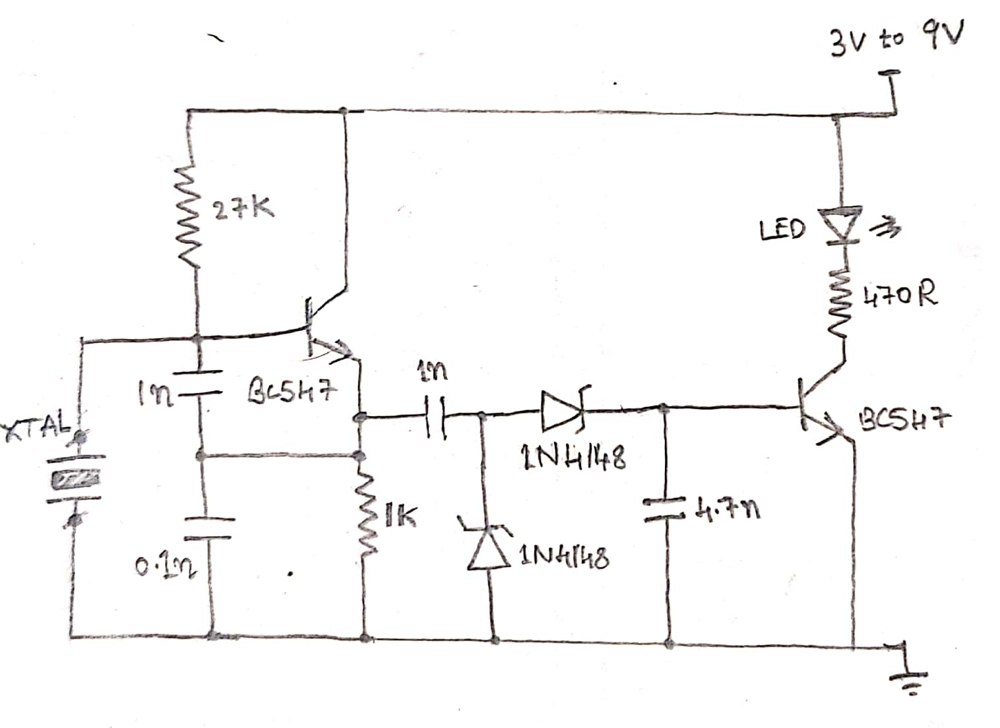
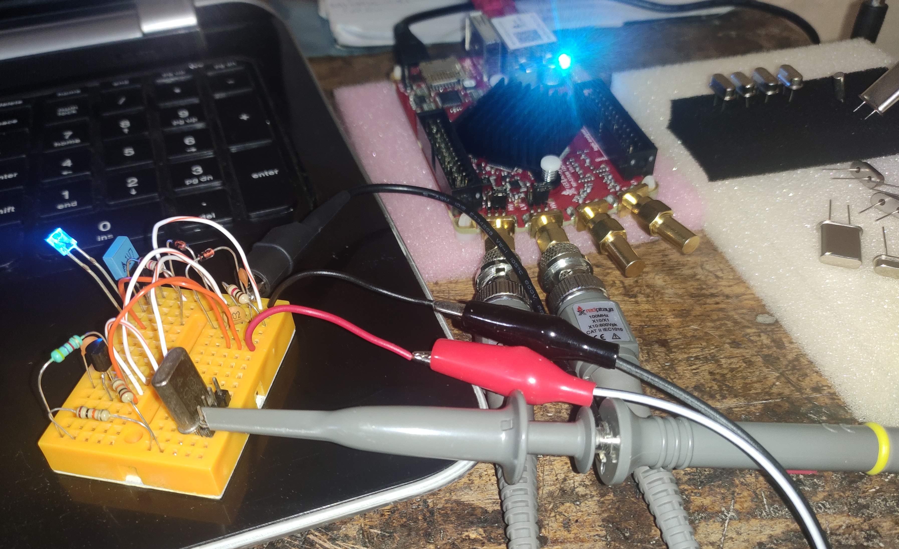
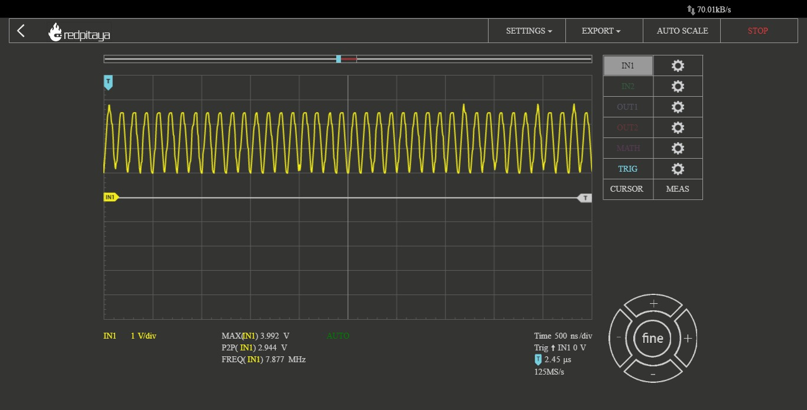

# DIY Crystal Tester Circuit

XTAL. They are found in most of the RF and processing circuitry as an external component to provide clocking, time reference for synchronization of internal system operations. Easy to find, get and collect these. But,....testing them isn't that straight forward by connecting its terminals to a multimeter or an oscilloscope.

This is an interesting test circuit for crystals in 1MHz - 30MHz range with 2 NPN transistors, Zeners, some passives, and thought of testing a few crystals which I had(also killed some good ones for test :/ )

The crystal is directly connected to the base terminal of one of the BC547 transistor. If the Device Under Test(DUT) crystal oscillates, the signal passes through the 1nF loading capacitor to the two fast switching diodes, thereby charging the 4.7nF capacitor and turns on the second transistor which in turn illuminates the LED, indicating that it's all good! If the crystal is not working or is faulty, the LED will fail to glow.

References:   
[1] http://talkingelectronics.com/projects/200TrCcts/200TrCcts.html  
[2] https://www.sciencedirect.com/topics/physics-and-astronomy/crystal-oscillators  
[3] https://www.youtube.com/watch?v=blalAktxFoI  
